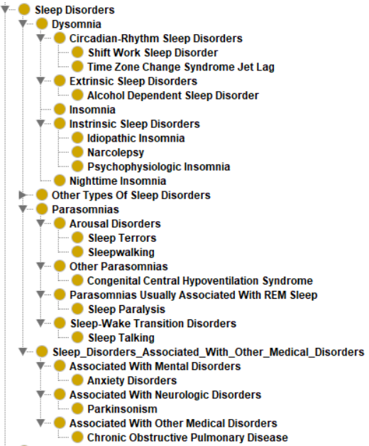

# Ontology-Thesis
Ontology developed for master thesis, in `RDF/XML` to model the influence relationships between sleep disorders and diseases.

Full thesis article in Spanish at: https://repositorio.uniandes.edu.co/entities/publication/d6aab2d7-fb8e-4231-af35-6953a3a51ba8

## Context
The implementation of the new ontology was done in `RDF/XML` using `Protégé 5.5.0`.
The ontology domain refers to sleep disorders. However, this being a domain studied by several disciplines, it was defined as the domain of Medicine, which encompasses not only Sleep Disorders, but also other diseases or factors that can trigger or cause Sleep Disorders, without leaving aside that Sleep Disorders are the central focus of this ontology.
For the creation of the ontology there are a total of:
- 500 classes including the entire class hierarchy all the way up to the superclasses.

On the other hand, in terms of instances there are:
- 437 entities which correspond to the last level of the subclasses. This is due to the fact that each of the subclasses is instantiated with an individual with the same name. It is worth mentioning, as will be shown in the Integration chapter, that there are ontologies that do not handle instances, but instead handle more levels of subclasses. Therefore, as the idea is to expand the ontology, it was decided to reach this level, to handle the relationships between instances and to enrich with another ontology, other types of classes that are not contemplated in the new ontology. In other words, the other ontologies have classes that could be considered.

As for the properties there are a total of:
- 109 Object Properties.
- 109 Domain and Range relationships of the properties.
- 637 connections between instances by means of the aforementioned relationships that are of type Object Properties.
- 486 subclass relationships
- 609 Annotation Properties, where each of the Classes, Entities (with the same name as the last level of the subclasses) and properties have the annotation `rdfs:label`.
All classes, properties and entities in the ontology have a `URI` given as follows, followed by the name of the class/entity or property:
`http://www.semanticweb.org/daniel/ontologies/2020/6/SDCO#Nombre_ent`

The Bioportal folder contains JAVA classes for extracting bioportal classes and properties.

The ontology folder contains three files:
* SDCOv2.owl -> is the ontology development created to model the influence relationships between sleep disorders and diseases.
* sdco_snomed_integrated.owl -> contains the ontology created in SDCOv2.owl and the integration with certain classes extracted from the SCNOMED CT ontology hosted in Bioportal.
* SPARQL_query.rq -> SPARQL queries for ontology information extraction.

The deployment of the network can be performed in GraphDB.

## Ontology visualization
Here you will find different examples of the construction and visualization of the ontology created and the integration with SNOMED CT.

### Sleep disorders taxonomy
